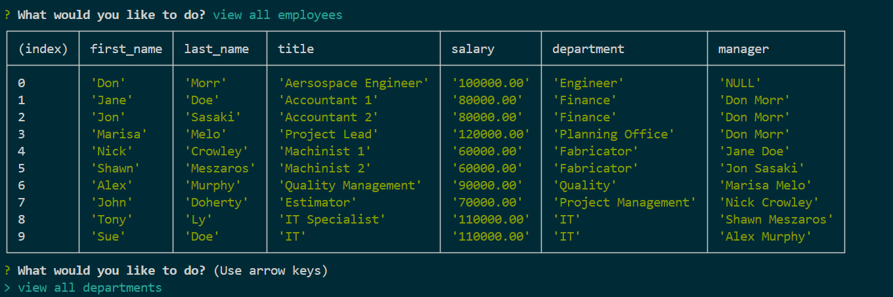
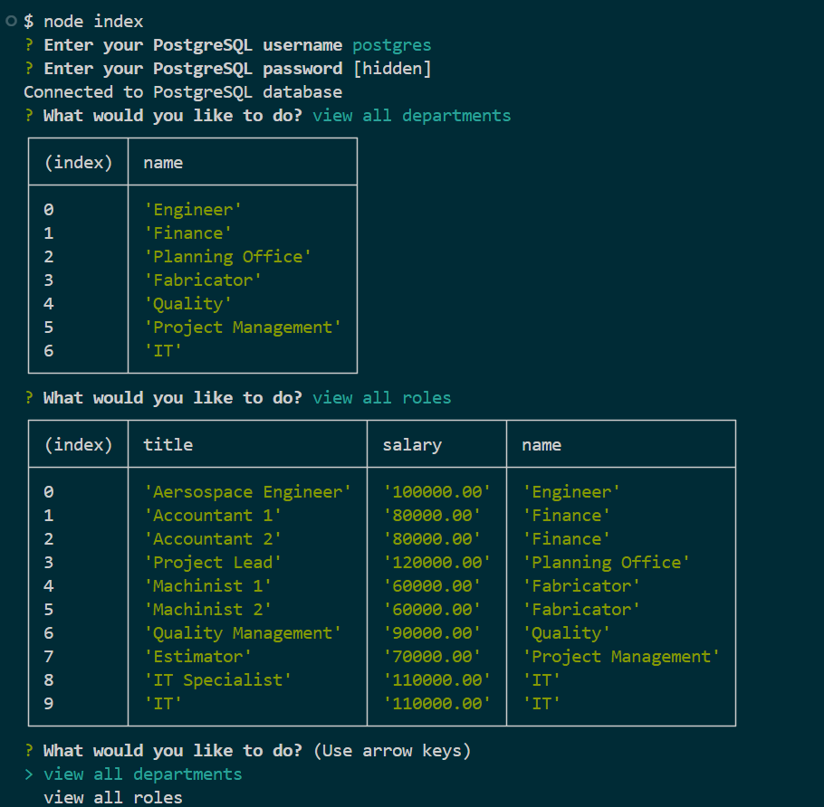

# Employee-Record

## Description
The Employee Record is a command-line application that uses Node.Js, Inquirer, and PostgreSQL. The application allows you to create, view, update and delete company departments, roles and employees.

## User Story
AS A business owner  
I WANT to be able to view and manage the departments, roles, and employees in my company 
SO THAT I can organize and plan my business 

## Acceptance Criteria
GIVEN a command-line application that accepts user input 
WHEN I start the application 
THEN I am presented with the following options: view all departments, view all roles, view all employees, add a department, add a role, add an employee, and update an employee role 
WHEN I choose to view all departments 
THEN I am presented with a formatted table showing department names and department ids 
WHEN I choose to view all roles 
THEN I am presented with the job title, role id, the department that role belongs to, and the salary for that role 
WHEN I choose to view all employees 
THEN I am presented with a formatted table showing employee data, including employee ids, first names, last names, job titles, departments, salaries, and managers that the employees report to 
WHEN I choose to add a department 
THEN I am prompted to enter the name of the department and that department is added to the database 
WHEN I choose to add a role 
THEN I am prompted to enter the name, salary, and department for the role and that role is added to the database 
WHEN I choose to add an employee 
THEN I am prompted to enter the employee’s first name, last name, role, and manager, and that employee is added to the database 
WHEN I choose to update an employee role 
THEN I am prompted to select an employee to update and their new role and this information is updated in the database 

## Usuage
In order to run the program you must download the following. 
Node.js and PostgreSQL.

## Installation 
1. Clone the repository to your local machine.
2. Run `npm install` to install the required packages.
3. Create a PostgreSQL database and update the `.env` file with your database credentials.
4. Run `node index` to start the application.
5. Follow the prompts to interact with the application.

## Video Walkthrough

## Screenshot

## Credits
Class Lectures 
Youtube 
Classmates - Thinh Nguyen and Faiza Haque 
AI Tools - CHATGPT and Copilot 

## Questions
If you have any questions or need further clarification, please don't hesitate to reach out to me at
marissa.melo91@yahoo.com or https://github.com/marissamelo91

